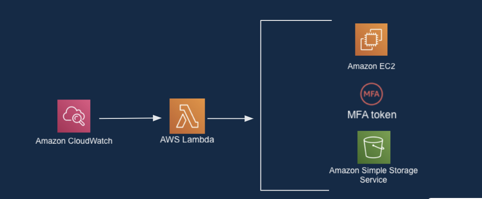
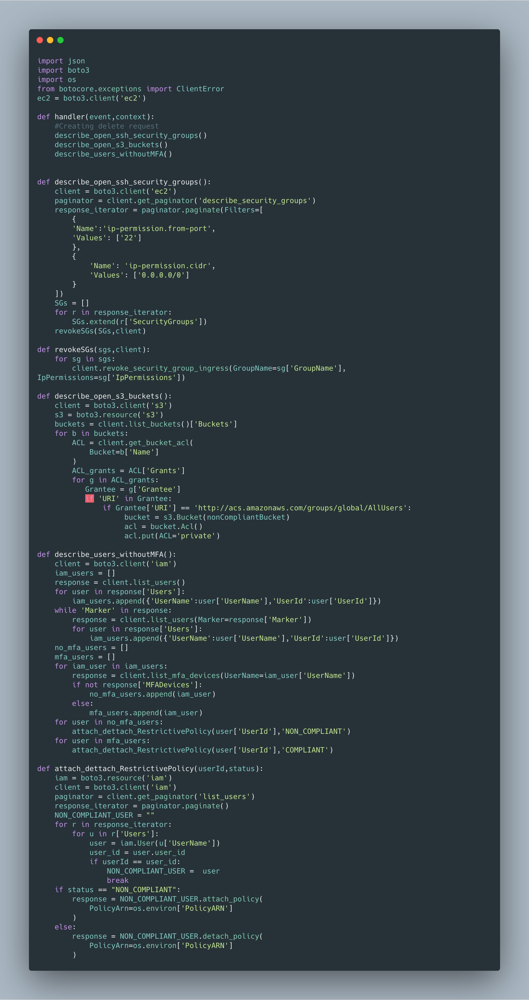

# AWS Cloudwatch Scheduled Event - Security Automation Solution

## Getting Started

This cloudformation stack deploys and configures the following resources:

* AWS Lambda
* AWS Lambda Execution Role
* AWS Log Group for sending AWS Lambda logs to Cloudwatch Logs
* IAM Policy
* AWS Cloudwatch Event

## Scenary

In this case we program the cloudwatch event to be triggered each one hour. It's not necessary to use AWS Config in this case, we only need Cloudwatch and the Lambda function.
In this scenary we are not working with events but with scheduled actions. We can use the boto3 SDK to call the AWS API and receive all the information we need to check three things:

  * If there are buckets with public ACL for reading or writing permissions.
  * If there are users with the MFA deactivated.
  * If there are Security Groups with the SSH port open to the Internet.
  
Once we have collected all the information from the API through the SDK, we can remediate the security problems.
In the SSH case it revokes the old rule in the Security Group. For the Public permissions in the S3 buckets, the function is able to change the ACL to a private status. Finally, for the MFA it attachs a restrictive IAM policy to the non compliant user, this policy only allows the user to activate his MFA, when the problem has been solved, in the following execution of the scheduled event, the lambda function will detach the restrictive policy to the user.

## Lambda Function

