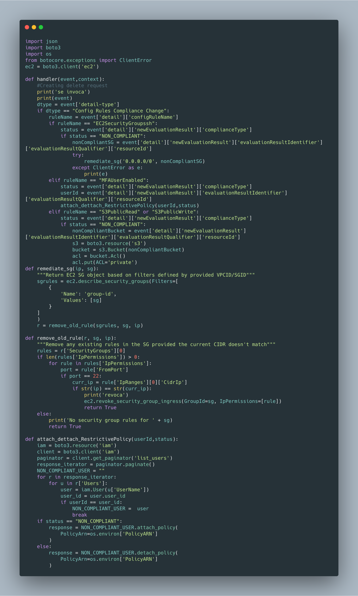

# AWS Config Automation

## Getting Started

This cloudformation stack deploys and configures the following resources:

* AWS Config
* AWS Config Recorder
* AWS Delivery Channel
* AWS Role for AWS Config
* AWS S3 Bucket (To store AWS Configuration Snapshots)
* AWS Lambda
* AWS Lambda Execution Role
* AWS Log Group for sending AWS Lambda logs to Cloudwatch Logs
* IAM Policy
* AWS Cloudwatch Event rule based on events
* Four AWS Config Rules

## Scenary

This template configures four config rules:

* ConfigRuleSSHrestricted
  * AWS Managed rule Id: INCOMING_SSH_DISABLED
  * It check if any Security Group has the SSH port open to the whole Internet.
  * Triggers when a configuration change is made.
* ConfigRuleIAMUser
  * AWS Managed rule Id: IAM_USER_MFA_ENABLED
  * It checks if users have MFA activated
  * The checks are done periodically each three hours (can be configure up to one hour)
* ConfigRuleS3write
  * AWS Managed rule Id: S3_BUCKET_PUBLIC_WRITE_PROHIBITED
  * It checks if there are buckets with a public ACL with write permissions.
* ConfigRuleS3read
  * AWS Managed rule Id: S3_BUCKET_PUBLIC_READ_PROHIBITED
  * It checks if there are buckets with a public ACL with read permissions.

The rules used are AWS managed rules so the trigger type cannot be changed.

When a rule is triggered it sends an evento to AWS Cloudwatch Event. There is a filter created in AWS Cloudwatch Event to start the AWS Lambda function only when a change in the compliance status of the config rule has ocurred.

When the compliance status changes, the lambda function triggered through the cloudwatch event checks what rule has changed, and it solves the problem.
In the SSH case it revokes the old rule in the Security Group. For the Public permissions in the S3 buckets, the function is able to change the ACL to a private status. Finally, for the MFA it attachs a restrictive IAM policy to the non compliant user, this policy only allows the user to activate his MFA, when the problem has been solved the lambda function detachs the restrictive policy to the user.

## Lambda Function

The lambda function code is embeded in the yaml stack for Cloudformation. The lambda code can be found in the image below.
The event from AWS Config is sent to the lambda function through Cloudwatch Events and is received in the handler inside the 'event' variable. Once it's received we are able to parse it and execute the remediation process. We use the boto3 SDK to call the AWS API.

