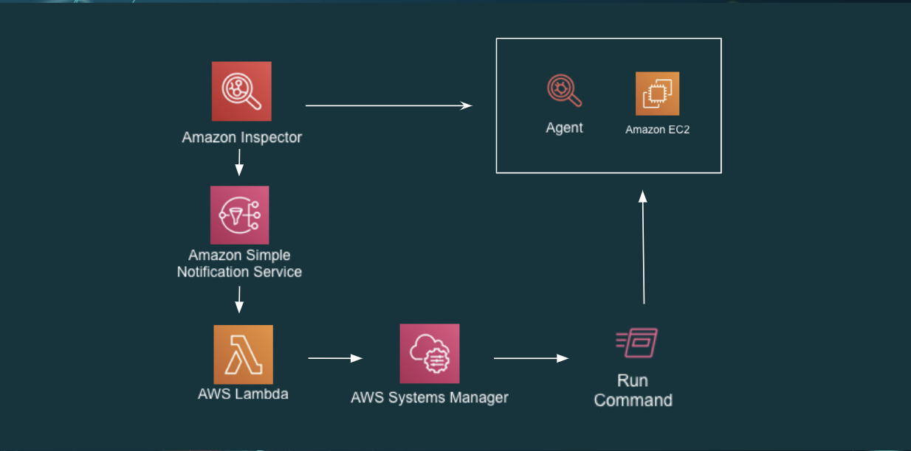
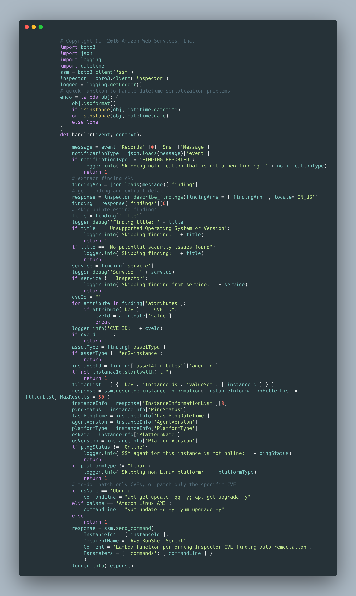

# AWS Inspector - CVE Remediation

It´s necessary to configure the SNS topic in the assessment template in the AWS Console. AWS Cloudformation does not allow to do it yet.

# AWS Config Automation

## Getting Started

This cloudformation stack deploys and configures the following resources:

* AWS Inspector
* AWS VPC
* AWS Subnet
* AWS EC2 Instance
* AWS Security Group
* AWS Internet Gateway
* AWS Lambda Execution Role
* AWS Log Group for sending AWS Lambda logs to Cloudwatch Logs
* AWS Lambda
* AWS Route Table
* AWS SNS Topic
* AWS EC2 Role for SSM

## Scenary

This template configures AWS Inspector with the CVE assessmemt template. It deploys an EC2 instance and it installs the AWS Inspector agent in the instance.
When an assessment run finishes it sends a message to SNS which triggers the Lambda function. 
The AWS Lambda function checks for the CVEs and it updates the OS.

## Lambda Function

The lambda function code is embeded in the yaml stack for Cloudformation. The lambda code can be found in the image below.

