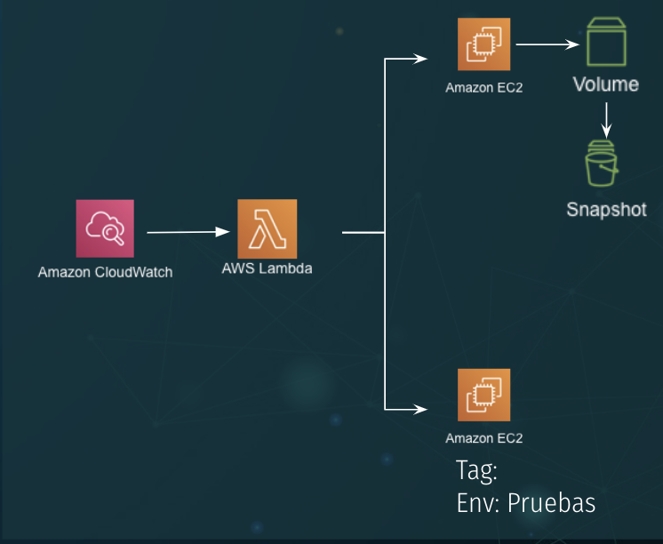

# AWS Lambda Function & Cloudformation Utils
Example:

## Getting Started
In this folder we want to collect lambda functions that could be useful for security purposes. Those functions could be configured with Cloudwatch to respond events or running periodically.

* Lambda for shuting down instances with a specific tag
* Lambda for creating EC2 Volume snapshots
* [AWS Lambda for Billing](https://github.com/asc-lab/aws-lambda-billing)
* [AWS Lambda functions for security controls] (https://github.com/awslabs/aws-lambda-security-controls)
